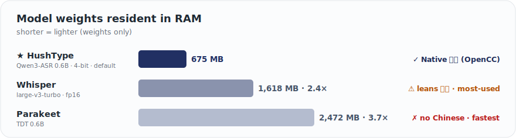

<p align="center">
  
</p>

<h1 align="center">HushType</h1>

<p align="center">
  Free, local voice-to-text built for Apple Silicon macOS<br>
  No data sent · low memory footprint · steady Traditional Chinese output
</p>

<p align="center">
  <strong>English</strong> | <a href="README.md">繁體中文</a>
</p>

<p align="center">
  Canonical repository: <a href="https://github.com/felixfu824/HushType">github.com/felixfu824/HushType</a>
</p>

> **HushType** is a free, open-source, offline speech-to-text app for macOS and iOS. It uses Qwen3-ASR ([macOS](https://huggingface.co/aufklarer/Qwen3-ASR-0.6B-MLX-4bit) / [iOS](https://huggingface.co/mlx-community/Qwen3-ASR-0.6B-4bit) mirrors) running locally on Apple Silicon (MLX) to transcribe English, Chinese, and Japanese — including mixed-language sentences. Delivers steady Traditional Chinese (繁體中文) output via OpenCC. A privacy-first alternative to cloud dictation and Whisper-based tools (heavier on RAM, prone to Simplified output) — built to stay light, so it coexists with everything you need running at once.

> 🌐 **HushType** 是一款免費、開源、離線的 macOS 與 iOS 語音轉文字 App，使用 Qwen3-ASR 在 Apple Silicon（MLX）上本地執行，透過 OpenCC 提供全 Mac 最道地的繁體中文輸出，專注在保持輕量，能與你需要同時跑的所有 App 共存。<br>→ 完整中文版 README：[README.md](README.md)

<p align="center">
  
</p>

<sub>Sizes are the weight files each tool ships at default precision. A 4-bit MLX Whisper-turbo exists (~464 MB) but still outputs mediocre / Simplified Chinese — so the claim is "the lightest ASR that nails Traditional Chinese," not "the smallest model."</sub>

---

## Why HushType

**Private and local-first.** Voice never leaves your Mac — the model runs on-device, no cloud, no account, no telemetry. One ~675 MB download, then fully offline.

**Memory-friendly — coexists with your agents.** The model is just ~675 MB — small enough to run alongside Claude Code/Cowork, Codex and a browser on an 8 GB Mac. More importantly, it manages its memory footprint automatically: HushType caps its memory buffer at launch, so there's nothing for you to manage. To free it entirely, one menu click unloads the model; it auto-reloads on your next Right ⌥ hold.

**Traditional Chinese that actually works.** Whisper and most open-source models default to Simplified or Mainland phrasing (软件, not 軟體). HushType chains Qwen3-ASR with OpenCC `s2twp` for Taiwan-native output — 軟體, 滑鼠, 品質 — with EN/ZH code-switching in one pass and optional in-context number conversion (`一零一大樓` → `101 大樓`), on by default.

**Live captions, two flavors.** Local **Live Caption** runs the same on-device pipeline onto a floating panel — free, offline, works on a plane (decent quality). Opt-in **Live Translated Caption** streams audio to OpenAI's `gpt-realtime-translate` for real-time subtitles in 14 languages (high quality) — your key (and your bill!), doesn't auto-start.

---

## Key Features

| Feature | Default | Requirement |
|---|---|---|
| Hold Right ⌥ to dictate (macOS) | ON | macOS 15+ |
| Tap Right ⌥ to translate selected text | OFF | macOS 14+ |
| **Live Caption** (local, free) — floating panel from mic or system audio | OFF | macOS 15+ |
| **Live Translated Caption** (cloud, ~$2/hr) — real-time foreign-language subtitles via OpenAI | OFF (opt-in) | Your own OpenAI API key |
| Right ⌘ + / — toggle whichever caption mode you used last | — | macOS 15+ |
| EN / ZH / JA + native code-switching | ON | — |
| 簡體 → 繁體 post-processing (OpenCC `s2twp`) | **ON** | — |
| 阿拉伯數字 conversion (deterministic ITN) | **ON** | — |
| AI Cleanup — filler removal, self-correction resolution | **OFF** (opt-in beta) | macOS 26 + Apple Intelligence |
| Customized dictionary (proper nouns / jargon) | File-driven | — |
| Floating "Listening / Transcribing" pill | ON | — |
| Unload speech-to-text model | One-click | — |
| iOS app + custom keyboard (Mac as server) | Optional | iOS 17+, Python on Mac |

---

## Use Cases

**Talking to AI agents.** Giving Claude or ChatGPT a detailed prompt takes 5 minutes to type, 30 seconds to say. Hold Right ⌥, speak your entire prompt (mixing languages as needed), release — text appears in the chat input. Local transcription means your prompts never leave your machine even if you're driving cloud-hosted agents.

**Voice notes on the go.** On the subway, Mac at home. Tap "Start Listening" on iPhone, switch to Notes, tap the mic button on the HushType keyboard. Audio travels over Tailscale to your Mac, transcribes in ~1 second, text appears.

**Reading in another language.** Select any text in Safari, Mail, Notes — anywhere — and tap Right ⌥. A translucent card pops up with the translation via Apple's on-device Translation Framework. Auto-dismisses after 10s, pauses on hover. No API key, no cloud.

**Watching foreign-language content.** Korean drama, Japanese news, Spanish football commentary. Open the source in any app, click **Live Translated Caption → From System Audio…** in the menu bar, pick the app — translated English (or whichever target you set) streams onto a floating caption panel anchored at the bottom of your screen. Right ⌘ + / toggles it on and off. The original-language line shows above the translation as a confidence check; cost chip in the header tracks the session bill against your own OpenAI key.

---

## How It Works

```
macOS (standalone — zero network required):
  Hold Right Option (≥0.3s) → speak → release → text at cursor
  Tap Right Option (<0.3s) with text selected → translation card
  Pipeline: mic → Qwen3-ASR (MLX, on-device) → OpenCC s2twp → ITN → paste

iOS (via your Mac as server):
  Open HushType → Start Listening → switch to any app → HushType keyboard → tap mic
  Pipeline: iPhone mic → WiFi/Tailscale → Mac server → Qwen3-ASR → OpenCC → result back → text inserted
```

```
                                     ┌──────────────────────────────────┐
                                     │  Mac (Apple Silicon)             │
  ┌──────────────┐   WiFi/Tailscale  │                                  │
  │ iPhone       │ ──── HTTP POST ──►│  ios_server.py (port 8000)       │
  │ HushType KB  │◄── JSON result ───│    ↓                             │
  └──────────────┘                   │  mlx-audio (port 8199)           │
                                     │    → Qwen3-ASR 0.6B (MLX/Metal)  │
                                     │    → OpenCC s2twp                │
                                     │                                  │
                                     │  HushType.app (menu bar)         │
                                     │    → Right Option hotkey         │
                                     │    → Local transcription         │
                                     └──────────────────────────────────┘
```

---

## Install

### Option A: Download DMG (no build tools needed)

1. Download `HushType.dmg` from the [latest release](https://github.com/felixfu824/HushType/releases)
2. Open the DMG and drag HushType to Applications
3. Right-click HushType.app → Open (required on first launch — the app is ad-hoc signed, not notarized)
4. Grant **Accessibility** and **Microphone** permissions when prompted
5. Wait for the model to download (~675 MB, one-time, progress shown in menu bar)

The DMG is self-contained — OpenCC and all dependencies are bundled. No Homebrew, no terminal commands.

> **iOS server support:** The DMG also includes the iOS server toggle in the menu bar. It requires Python 3 and additional packages to be installed separately — see the [iOS setup guide](#setup-guide-ios-iphone--mac-server) below. If dependencies are missing, the app will show an error with the exact `pip3 install` command needed.

### Option B: Build from source

See [Prerequisites](#prerequisites-and-dependencies) and [macOS Setup Guide](#setup-guide-macos) below.

---

## Updating

Updating means **replacing the `.app` bundle**. Preferences, the ASR model, and user data live outside the bundle and are preserved.

**DMG:** quit HushType, drag the new `HushType.app` onto the Applications shortcut in the new DMG (click **Replace**), relaunch from Spotlight.

**From source:** `git pull && make install`.

**Permission re-grant:** because HushType is ad-hoc signed, macOS may require Accessibility to be enabled again after an update. The setup window will show the current permission state. Click **Open System Settings**, enable HushType in Accessibility, then click **Restart HushType** so macOS applies the grant. If you see duplicate HushType entries, cannot find HushType, or the switch does not work, use **Reset Old HushType Entry** in the setup window and add/enable HushType again.

**Full uninstall:** Trash `/Applications/HushType.app`, then optionally `defaults delete com.felix.hushtype` and `rm -rf ~/.cache/huggingface/hub/models--*Qwen3-ASR*` to remove preferences and the model cache.

---

## Prerequisites and Dependencies

> **Note:** If you installed via DMG (Option A), skip this section — everything is bundled. These are only needed for building from source or setting up the iOS server.

**Hardware and OS:**

| Requirement | Purpose |
|---|---|
| Mac with Apple Silicon (M1+) | MLX inference requires Metal GPU |
| macOS 15.0+ | Minimum OS for speech-swift |
| iPhone with iOS 17+ | iOS client (optional) |

**Software dependencies (build from source):**

| Dependency | Purpose | Install | Required for |
|---|---|---|---|
| [Homebrew](https://brew.sh) | Package manager | See brew.sh | Build from source |
| [opencc](https://formulae.brew.sh/formula/opencc) | Simplified → Traditional Chinese | `brew install opencc` | Build from source (bundled in DMG) |
| [speech-swift](https://github.com/soniqo/speech-swift) | Qwen3-ASR on Apple Silicon (MLX) | Automatic via SPM | Build from source |
| [Python 3.13+](https://python.org) | iOS server runtime | `brew install python` | iOS only |
| [mlx-audio](https://github.com/Blaizzy/mlx-audio) | STT server for iOS | `pip3 install "mlx-audio[stt,server]"` | iOS only |
| [httpx](https://www.python-httpx.org/) | Async HTTP for proxy server | `pip3 install httpx` | iOS only |
| webrtcvad-wheels, setuptools | mlx-audio runtime deps | `pip3 install webrtcvad-wheels setuptools` | iOS only |
| [xcodegen](https://github.com/yonaskolb/XcodeGen) | iOS Xcode project generation | `brew install xcodegen` | iOS only |
| [Xcode 16+](https://developer.apple.com/xcode/) | Building the iOS app | Mac App Store | iOS only |
| [Tailscale](https://tailscale.com) | Encrypted iPhone-to-Mac from anywhere | See tailscale.com | Optional |

---

## Setup Guide: macOS

### Step 1: Clone and build

```bash
git clone https://github.com/felixfu824/HushType.git
cd HushType

# Install dependencies
brew install opencc

# Build and install to /Applications
make install
```

### Step 2: Launch and grant permissions

1. Launch HushType from Spotlight (Cmd+Space → HushType)
2. On first launch, the **Set Up HushType** window shows the required permissions: Accessibility and Microphone.
3. Click **Open System Settings** in the Accessibility card. Find HushType in the Accessibility list and **toggle it on**. If HushType is missing, use the small helper panel to drag HushType into the list.
4. Click **Allow Microphone** and approve the macOS microphone prompt.
5. Return to HushType and click **Restart HushType** — the app relaunches itself with the new Accessibility permission active. (macOS caches the permission check per-process, so a restart is mandatory after granting — HushType handles it for you.)
6. Wait for the model to download (~675 MB, one-time, progress shown in menu bar)

### Step 3: Use it

- **Hold Right Option (≥0.3s)** — record. A "Listening" pill with a live audio meter shows at the bottom of the screen.
- **Release** — pill switches to "Transcribing"; transcribed text pastes at your cursor and stays on the clipboard.
- **Tap Right Option (<0.3s)** — with text selected, translates via Apple Translation Framework into a floating card. See [Text Translation](#optional-text-translation-macos-14).

**Menu bar:**

- **Language** — Auto / English / Chinese / Japanese
- **Show Floating Indicator** — toggle the listening pill (default on)
- **Number Conversion** — Chinese numeral → Arabic digit pass (default on)
- **Text Translation** — enable tap-to-translate (macOS 14+)
- **AI Cleanup** — Apple Foundation Models post-processing (macOS 26+, off by default)
- **Unload Speech-to-Text Model** — frees ~2 GB RAM; reload from the same menu (~3s cold start)
- **Edit Customized Dictionary** — `~/Library/Application Support/HushType/dictionary.txt`, plain text, `source -> target` per line, hot-reloads

That's it. No server, no network, no configuration.

### Optional: Live Caption / Live Translated Caption (macOS 15+)

Two products sharing the same floating caption panel. Mutually exclusive at runtime — starting one auto-stops the other.

**Live Caption** (free, local, on-device):

1. Status-bar menu → click **Live Caption** to toggle (uses last-known source — defaults to mic on first use), or pick **From Microphone** / **From System Audio…** explicitly.
2. System Audio first time → pick the app whose audio you want to caption from the picker.
3. Captions stream onto a floating panel pinned near the bottom of your screen. The panel is draggable and resizable; its frame is remembered across stops.

**Live Translated Caption** (~$2/hr against your own OpenAI account):

1. Get an API key at https://platform.openai.com/api-keys.
2. Status-bar menu → **Live Translated Caption → Translated Caption Settings…** → click **Open file in TextEdit** and paste your key into `openai.json` as the `api_key` field.
3. Pick a target language in the same settings window (default: English; 13 others including 繁體中文 / 简体中文 / 日本語 / 한국어 / Español / Français / Deutsch).
4. Click **Live Translated Caption → From Microphone** (or **From System Audio…**) in the menu. First time you do this, a one-time disclosure modal explains the cost and privacy profile — accept once and it stays accepted.
5. A cost chip in the caption panel header (e.g. `12:34 · $0.42`) shows session duration and spend. Auto-stop minutes and daily-cap warnings are configurable in the same settings window.

**Hotkey** (both products): Right ⌘ + / toggles **whichever product you last started**. First-use default is local (Live Caption). The menu items are the authoritative way to pick a specific product + source.

**Mid-session switching:** Clicking the other product's menu item while one is running auto-stops the current session and starts the new one. Clicking the same product's other source switches in place without rebuilding the panel.

### Optional: Text Translation (macOS 14+)

On-device translation via Apple Translation Framework. Select any text → tap Right Option (<0.3s) → translucent card appears with the translation, also auto-copied to clipboard. Card auto-dismisses after 10s; hover to pause, click or Escape to dismiss now.

**Direction:** Chinese → English; everything else → Traditional Chinese. Override via menu bar or `defaults write hushtype.translateTargetLanguage`.

**Enable:** Menu bar → **Text Translation**. The toggle runs a sanity-check; if Translation Framework isn't available, the toggle stays off with a clear error.

### Optional: AI Cleanup (opt-in beta, macOS 26+)

HushType ships with AI Cleanup **off by default**. When enabled, each transcription is passed through Apple's on-device Foundation Models framework, which (1) strips leading filler words (`um`, `uh`, `嗯`, `那個`), (2) collapses immediate duplicates while preserving emphatic repetitions, and (3) resolves explicit self-corrections (`I'll send it Wednesday no actually Friday` → `I'll send it Friday`).

**Why off by default:** AI Cleanup rewrites your transcription content. The deterministic ITN layer (Chinese numeral → Arabic digit) is on by default because it's reversible and bounded; AI Cleanup is opt-in because semantic rewriting is a stronger commitment.

**Requirements:** macOS 26 (Tahoe) + Apple Intelligence enabled + Apple Silicon.

**How to enable:** Menu bar → AI Cleanup. HushType runs a quick round-trip test against the on-device model; if Apple Intelligence isn't available, you get a clear error and the toggle stays off. On success, future transcriptions are cleaned automatically. If the on-device model errors mid-transcription, HushType silently falls back to the uncleaned text — you never see a broken result.

**Known limitations (beta):** Occasional over-pruning of Chinese adverbs (`我一直都在` may become `我一直在`); trailing particles may leak through after self-correction resolution; English numerals inside Chinese context get converted (`我買了 five 本書` → `我買了 5 本書`, accepted behavior); Japanese is tested minimally.

---

## Setup Guide: iOS (iPhone + Mac Server)

The iOS app uses your Mac as the transcription server. Your iPhone sends audio to your Mac over WiFi or Tailscale, and receives the transcribed text back.

### Step 1: Install server dependencies on Mac

```bash
# Python packages for the transcription server
pip3 install "mlx-audio[stt,server]" webrtcvad-wheels setuptools httpx

# OpenCC for Traditional Chinese + xcodegen for iOS project
brew install opencc xcodegen
```

### Step 2: Get your Mac's IP address

```bash
# If using Tailscale (works from anywhere):
tailscale ip -4
# Example output: 100.x.x.x

# If using LAN only (same WiFi):
ipconfig getifaddr en0
# Example output: 192.168.50.50
```

Write down this IP — you'll enter it on your iPhone later.

### Step 3: Start the iOS server on Mac

**Option A — From HushType menu bar (recommended):**
Click the HushType icon in menu bar → "Start iOS Server"

**Option B — From terminal:**
```bash
cd HushType
python3 scripts/ios_server.py
# Server starts on 0.0.0.0:8000
# First transcription request will download the model (~675 MB)
```

Verify the server is running:
```bash
curl http://localhost:8000/
# Should return: {"status":"ok","service":"HushType iOS Server","opencc":true}
```

### Step 4: Build and install the iOS app

```bash
cd iOS
xcodegen generate
open HushType.xcodeproj
```

In Xcode:
1. Click the **HushType** project in the navigator (top left)
2. Select the **HushType** target → Signing & Capabilities → set **Team** to your Apple ID
3. Select the **HushTypeKeyboard** target → same thing, set **Team**
4. If Xcode shows "Update to recommended settings" → click **Perform Changes**
5. Connect iPhone via USB cable
6. Select your iPhone as the run destination (top bar)
7. Click **Run** (Cmd+R)

First-time build takes ~1 minute. Subsequent builds are faster.

### Step 5: Set up iPhone

These steps happen on the iPhone itself:

**5a. Enable Developer Mode** (one-time):
1. Settings → Privacy & Security → Developer Mode → toggle **On**
2. iPhone will restart. After restart, confirm "Turn On" when prompted.

**5b. Trust the developer** (one-time):
1. Settings → General → VPN & Device Management
2. Tap your Apple ID under "Developer App"
3. Tap **Trust**

**5c. Add the HushType keyboard** (one-time):
1. Settings → General → Keyboard → Keyboards → **Add New Keyboard**
2. Scroll down to "Third-Party Keyboards" → tap **HushType**
3. Tap **HushType** in the keyboard list → toggle **Allow Full Access** → confirm

> **Important:** Full Access must be enabled. Without it, the keyboard cannot communicate with the main app or access the network. If the mic button doesn't respond, this is the most common cause.

### Step 6: Configure and test

1. Open the **HushType** app on iPhone
2. Enter your Mac's IP address: `http://<your-ip>:8000` (the IP from Step 2)
3. Tap **Test Connection** → should show green "Connected"
4. Tap **Start Listening** — the orange microphone indicator appears at the top of the screen
5. The app shows a 5-minute countdown timer

### Step 7: Use it

1. Switch to any app (Messages, Notes, Safari, etc.)
2. Long-press the **globe key** on your keyboard → select **HushType**
3. Tap the **mic button** → speak → tap **stop**
4. Wait 1-2 seconds → transcribed text appears at your cursor
5. Use **space**, **backspace**, and **return** buttons for basic editing

When the 5-minute session expires, return to the HushType app and tap "Start Listening" again.

### After setup: Daily usage

You only need to repeat Steps 3 + 6-7 each day:
1. Make sure the iOS server is running on Mac (menu bar → "Start iOS Server")
2. Open HushType on iPhone → Start Listening
3. Switch to your app → use the keyboard

The USB cable is only needed for installing/updating the app from Xcode. Normal usage is wireless.

> **Note:** With free Apple ID provisioning, the app expires every 7 days. When it stops launching, reconnect USB → Xcode → Cmd+R to reinstall. Your settings are preserved. A paid Apple Developer account ($99/year) extends this to 1 year.

---

## Configuration

### macOS

```bash
# View all settings
defaults read com.felix.hushtype

# Language: nil=auto, "english", "chinese", "japanese"
defaults write com.felix.hushtype hushtype.language -string "chinese"

# Model: default "aufklarer/Qwen3-ASR-0.6B-MLX-4bit" on macOS;
# alternative "mlx-community/Qwen3-ASR-1.7B-8bit" for better quality.
defaults write com.felix.hushtype hushtype.modelId -string "mlx-community/Qwen3-ASR-1.7B-8bit"

# Traditional Chinese conversion (default: true)
defaults write com.felix.hushtype hushtype.chineseConversionEnabled -bool false

# Number conversion / ITN — Chinese numeral → Arabic digit (default: true)
defaults write com.felix.hushtype hushtype.numberConversionEnabled -bool false

# Floating "Listening / Transcribing" indicator (default: true)
defaults write com.felix.hushtype hushtype.floatingOverlayEnabled -bool false

# AI Cleanup via Apple Foundation Models (default: false, requires macOS 26+)
# Prefer toggling from the menu bar — the menu validates FoundationModels
# availability and shows a clear error if Apple Intelligence isn't enabled.
defaults write com.felix.hushtype hushtype.aiCleanupEnabled -bool true

# Text Translation via Apple Translation Framework (default: false, requires macOS 14+)
defaults write com.felix.hushtype hushtype.textTranslationEnabled -bool true

# Translation target language (default: nil = auto — Chinese→English, other→繁體中文)
# Set to a specific language code to override (e.g., "en", "zh-Hant-TW", "ja")
defaults write com.felix.hushtype hushtype.translateTargetLanguage -string "en"
```

### iOS

- Server URL: configured in the app UI (persisted in App Group)
- Session duration: 5 minutes (hardcoded in BackgroundAudioManager.swift)
- Model: `mlx-community/Qwen3-ASR-0.6B-4bit` (hardcoded in RemoteTranscriber.swift)

### Changing the Hotkey (macOS)

Edit `Sources/HushType/HotkeyManager.swift`:
```swift
private static let rightOptionKeyCode: Int64 = 61
```

Common keycodes: Right Option (61), Right Command (54), Left Option (58), Left Control (59), Fn/Globe (63).

---

## Privacy & Security

- **No audio is stored.** Voice data exists only in RAM during the recording → transcription pipeline, then discarded. Nothing is written to disk — not on macOS, not on the iOS server.
- **No network after setup.** The only internet access is the one-time model download (~675 MB) on first launch. After that, the app and the model run fully offline with zero outbound connections.
- **No telemetry.** No analytics, no usage tracking, no phone-home. The macOS app contains zero network code beyond the initial model fetch (handled by the HuggingFace Hub SDK inside speech-swift) and an optional GitHub releases check for update notifications.
- **Cloud Live Translated Caption uses YOUR key directly to OpenAI.** Opt-in, off by default, never auto-resumes across launches. Your API key is stored in plaintext at `~/Library/Application Support/HushType/openai.json` (same security profile as `.env`) — `chmod 600 ~/Library/Application\ Support/HushType/openai.json` if you want a tighter mode bit. Audio streams Mac → OpenAI via WSS; HushType operates no servers, intermediates no traffic, and never sees your audio, your key, or your spend. The engine resets to local on every app launch — you re-opt-in each time you want the cloud path.
- **iOS audio stays on your network.** iPhone audio travels directly to your Mac over local WiFi or Tailscale (WireGuard-encrypted). No third-party server is involved.
- **Fully air-gappable.** Pre-download the model folder on another machine (`~/.cache/huggingface/hub/models--aufklarer--Qwen3-ASR-0.6B-MLX-4bit/` for the macOS app, `~/.cache/huggingface/hub/models--mlx-community--Qwen3-ASR-0.6B-4bit/` for the iOS server) and copy it over — the app will never need internet.

---

## Project Structure

```
HushType/
├── Package.swift                      SPM config (macOS target)
├── Makefile                           build / install / clean / dmg
├── Sources/HushType/                  macOS menu bar app
│   ├── main.swift                     NSApplication bootstrap
│   ├── AppDelegate.swift              Orchestrator + state machine
│   ├── StatusBarController.swift      Menu bar icon + menus + iOS server toggle
│   ├── IOSServerManager.swift         Manages ios_server.py subprocess
│   ├── OnboardingManager.swift        First-launch / repair permission orchestration
│   ├── OnboardingSetupWindowController.swift  Setup window for Accessibility + Microphone
│   ├── PermissionSettingsGuidePanel.swift     Floating helper for macOS permission lists
│   ├── DraggableAppTileView.swift     Draggable HushType.app tile for System Settings
│   ├── SystemAudioPermissionFlow.swift        Screen & System Audio permission flow
│   ├── SystemAudioPermissionWindowController.swift  System-audio permission setup panel
│   ├── HotkeyManager.swift            CGEvent tap for Right Option
│   ├── AudioCaptureService.swift      AVAudioEngine mic capture (16kHz mono, RMS publisher)
│   ├── TranscriptionEngine.swift      Protocol + Qwen3ASR wrapper (MLX)
│   ├── ChineseConverter.swift         OpenCC s2twp (Simplified → Traditional)
│   ├── NumberNormalizer.swift         Deterministic Chinese-numeral → Arabic-digit ITN
│   ├── DictionaryReplacer.swift       Customized dictionary (final post-processing step)
│   ├── TextInserter.swift             Clipboard + Cmd+V paste (result persists on clipboard)
│   ├── InputSourceManager.swift       CJK input method detection
│   ├── FloatingOverlayWindow.swift    Borderless NSPanel for the listening pill
│   ├── FloatingOverlayView.swift      SwiftUI pill: RMS bars + transcribing spinner
│   ├── AICleaner.swift                Non-gated façade over FoundationModels cleanup
│   ├── FoundationModelsCleaner.swift  macOS 26+ gated Apple FM wrapper
│   ├── CleanupPrompt.swift            Phase 4 AI Cleanup prompt (filler + self-correction)
│   ├── TranslationManager.swift       Apple Translation Framework integration
│   ├── TranslationCardWindow.swift    Floating translation card NSPanel
│   ├── TranslationCardView.swift      SwiftUI translation card view
│   ├── LiveCaptionManager.swift       Local/cloud live caption orchestration
│   ├── LiveCaptionWindow.swift        Floating live caption panel
│   ├── LiveCaptionView.swift          SwiftUI live caption panel view
│   ├── LiveCaptionWorker.swift        Streaming local ASR worker
│   ├── LocalQwen3Backend.swift        Local Live Caption backend
│   ├── OpenAITranslateBackend.swift   Cloud translated-caption backend
│   ├── OpenAIKeyStore.swift           User OpenAI API key file handling
│   ├── CloudOnboardingAlert.swift     One-time cloud disclosure
│   ├── SystemAudioSource.swift        ScreenCaptureKit system-audio source
│   ├── SystemAudioPicker.swift        App/source picker for system audio
│   ├── MemoryUtils.swift              Process memory reading utilities
│   └── AppConfig.swift                UserDefaults wrapper
├── scripts/
│   ├── ios_server.py                  FastAPI proxy: mlx-audio + OpenCC
│   └── build_mlx_metallib.sh          MLX Metal shader compilation
├── Resources/
│   ├── Info.plist                     LSUIElement, mic usage description
│   ├── HushType.png                   App icon (1024x1024)
│   └── HushType.icns                  macOS app icon
└── iOS/                               iPhone app + keyboard extension
    ├── project.yml                    xcodegen project spec
    ├── Shared/                        Shared between app + keyboard extension
    │   ├── AppGroupConstants.swift    App Group keys + file-based IPC
    │   ├── IPCConstants.swift         Darwin notification names
    │   └── WAVEncoder.swift           Float32 → 16-bit PCM WAV
    ├── VoxKey/                        Main iOS app (directory name kept from v1)
    │   ├── VoxKeyApp.swift            SwiftUI entry point (@main HushTypeApp)
    │   ├── Views/ContentView.swift    Server config, listening session, countdown
    │   ├── Services/
    │   │   ├── AudioRecorder.swift    AVAudioEngine with listening + recording modes
    │   │   ├── BackgroundAudioManager.swift  Session timer, IPC polling, background
    │   │   └── RemoteTranscriber.swift       HTTP multipart POST to Mac server
    │   ├── Assets.xcassets/           App icon asset catalog
    │   └── Resources/silence.wav      Background audio fallback
    └── VoxKeyKeyboard/                Custom keyboard extension
        └── KeyboardViewController.swift  Mic, space, backspace, return, globe
```

## Customizing for Your Own Setup

To run HushType on your own devices, change these:

| What | Where | Example |
|---|---|---|
| Bundle ID | `iOS/project.yml` (both targets) + `iOS/Shared/AppGroupConstants.swift` | `com.yourname.hushtype` / `group.com.yourname.hushtype` |
| Server URL default | `iOS/VoxKey/Views/ContentView.swift` | Your Tailscale or LAN IP |
| Hotkey | `Sources/HushType/HotkeyManager.swift` | Any modifier keycode |
| Model | `iOS/VoxKey/Services/RemoteTranscriber.swift` + `scripts/ios_server.py` | `mlx-community/Qwen3-ASR-1.7B-8bit` for better quality |
| Session timeout | `iOS/VoxKey/Services/BackgroundAudioManager.swift` | `sessionDuration` property |
| OpenCC config | `Sources/HushType/ChineseConverter.swift` + `scripts/ios_server.py` | Change `s2twp` to `s2t` for standard Traditional |

---

## Troubleshooting

**macOS: "MLX error: Failed to load the default metallib"**
Run: `bash scripts/build_mlx_metallib.sh release`

**macOS: Hotkey not working**
Check Accessibility permission in System Settings → Privacy & Security → Accessibility. HushType must be in the list and toggled on. If HushType is missing or the switch does not work, relaunch HushType and use **Reset Old HushType Entry** from the setup window, then add/enable HushType again. If you just granted Accessibility and the hotkey still does not work, click **Restart HushType** in the setup window or quit and relaunch manually — macOS caches the permission check per-process.

**iOS: "App Transport Security" error**
The Info.plist must have `NSAllowsArbitraryLoads = true` with NO `NSExceptionDomains` — they conflict and cause iOS to ignore the global allow.

**iOS: Mic button does nothing (no recording starts)**
Most common cause: **Full Access is not enabled**. Go to Settings > General > Keyboard > Keyboards > HushType > toggle Allow Full Access. Without this, the keyboard extension cannot communicate with the main app.

**iOS: Keyboard stuck on "Transcribing..."**
The main app isn't receiving commands. Ensure:
1. HushType app is open and showing "Listening" with the orange mic dot
2. The Mac server is running (`curl http://<mac-ip>:8000/`)
3. App Group container works (check Xcode console for "App Group container: /path...")

**iOS: "Open HushType app first"**
The main app isn't running or the listening session expired (5-min timeout). Open HushType app and tap "Start Listening" again.

**iOS: App stops working after 7 days**
Free provisioning signing expires. Reconnect iPhone via USB, open Xcode, Cmd+R to reinstall. Settings are preserved.

**Server: Port already in use**
```bash
lsof -ti :8000 :8199 | xargs kill
```

---

## Known Limitations

- iOS requires Mac to be on and server running (no cloud fallback)
- Free provisioning: iOS app expires every 7 days (re-sign via Xcode)
- Session timeout is fixed at 5 minutes (no UI to change yet)
- Mac must be reachable from iPhone (same WiFi or Tailscale)
- DMG is ad-hoc signed (not notarized) — macOS Gatekeeper will warn on first launch. Right-click → Open to bypass.
