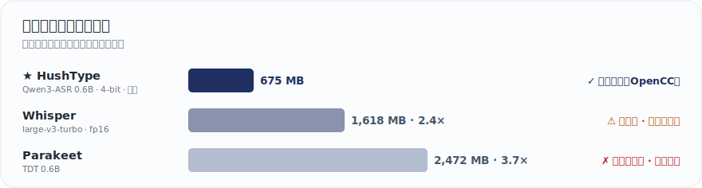

<p align="center">
  
</p>

<h1 align="center">HushType</h1>

<p align="center">
  專為 Apple Silicon macOS 打造的本地免費語音轉文字 App<br>
  不回傳數據、低記憶體占用、穩定繁體中文輸出
</p>

<p align="center">
  <a href="README.en.md">English</a> | <strong>繁體中文</strong>
</p>

<p align="center">
  官方 repository：<a href="https://github.com/felixfu824/HushType">github.com/felixfu824/HushType</a>
</p>

> **HushType** 是一款免費、開源、離線的 macOS 與 iOS 語音轉文字 App。使用 Qwen3-ASR（[macOS](https://huggingface.co/aufklarer/Qwen3-ASR-0.6B-MLX-4bit) / [iOS](https://huggingface.co/mlx-community/Qwen3-ASR-0.6B-4bit) 映像）在 Apple Silicon（MLX）上本地執行，支援英文、中文、日文的語音輸入——包含混用多語的句子。透過 OpenCC 提供穩定的繁體中文輸出。是雲端聽寫服務與 Whisper 衍生工具（記憶體用量較高、傾向輸出簡體中文）的隱私優先替代方案，專注在保持輕量，能與你需要同時跑的所有 App 共存。

> 🌐 **HushType** is a free, on-device dictation app for Apple Silicon Macs (and iOS). It runs Qwen3-ASR locally via MLX for English, Chinese, and Japanese — including mixed-language sentences — and is the only Mac dictation tool with genuinely native Traditional Chinese output (via OpenCC), light enough to run alongside your AI agents.<br>→ Read the full English README: [README.en.md](README.en.md)

<p align="center">
  
</p>

<sub>數字為各工具預設精度的模型權重大小。另有 4-bit Whisper-turbo（約 464 MB），但中文輸出仍偏簡體、品質平庸——所以我們的定位是「能做出道地繁中的最輕量 ASR」，而非「最小的模型」。</sub>

---

## 為什麼選擇 HushType

**隱私與本地優先。** 語音永遠不離開你的 Mac——模型完全在本機執行，無雲端、無帳號、無使用追蹤。只有首次一次性模型下載（約 675 MB），之後完全離線。

**記憶體友善——與你的 AI 助手共存。** 模型只有約 675 MB，小到能在 8 GB 的 Mac 上與 Claude Code/Cowork、Codex、瀏覽器同時運行。更關鍵的是會自動控管記憶體占用：HushType 啟動時就替記憶體暫存設上限，你完全不用管。需要完全釋放記憶體占用亦可在選單一鍵卸載，下次按住 Right ⌥ 自動重新載入。

**真正能用的繁體中文。** Whisper 與多數開源模型預設輸出簡體或大陸用語（软件 而非 軟體）。HushType 串接 Qwen3-ASR 與 OpenCC `s2twp` 做台灣在地輸出——軟體、滑鼠、品質——支援英中同句混用辨識，並可選擇將中文數字依語境轉成阿拉伯數字（`一零一大樓` → `101 大樓`），預設開啟。

**字幕兩種模式。** 本機 **Live Caption（即時字幕）** 用同一套裝置端管線把字幕顯示在浮動面板上：免費、離線、飛機上也能用（品質普通）。可選的 **Live Translated Caption（即時翻譯字幕）** 把音訊串到 OpenAI 的 `gpt-realtime-translate`，即時產生 14 種語言的字幕（高品質）——金鑰是你的（帳單也是你的！），不自動啟動。

---

## 主要功能

| 功能 | 預設 | 系統需求 |
|---|---|---|
| 按住 Right ⌥ 進行語音輸入（macOS）| ON | macOS 15+ |
| 輕按 Right ⌥ 翻譯選取的文字 | OFF | macOS 14+ |
| **Live Caption（本機，免費）** — 浮動字幕面板，麥克風或系統音訊 | OFF | macOS 15+ |
| **Live Translated Caption（雲端，約 $2/小時）** — 即時外文翻譯字幕，使用 OpenAI | OFF（自行開啟） | 你自己的 OpenAI API key |
| Right ⌘ + / — 切換上次用過的字幕模式 | — | macOS 15+ |
| 英文 / 中文 / 日文 + 原生混用 | ON | — |
| 簡體 → 繁體 後處理（OpenCC `s2twp`）| **ON** | — |
| 阿拉伯數字轉換（確定性 ITN）| **ON** | — |
| AI Cleanup——清除贅字、自我修正解析 | **OFF**（opt-in beta）| macOS 26 + Apple Intelligence |
| 自訂字典（專有名詞 / 行話）| 檔案驅動 | — |
| 浮動「Listening / Transcribing」指示條 | ON | — |
| 卸載語音轉文字模型 | 一鍵 | — |
| iOS App + 自訂鍵盤（以 Mac 為伺服器）| 選用 | iOS 17+、Mac 上需有 Python |

---

## 使用情境

**與 AI 助手對話。** 給 Claude 或 ChatGPT 一段詳細的 prompt，打字要 5 分鐘，用說的只要 30 秒。按住 Right ⌥，自然地說完整段 prompt（可任意混用語言）、放開——文字立刻出現在聊天輸入框中。本地轉錄意味著：即使你正在使用雲端託管的 AI 助手，你的 prompt 也不會離開你的機器。

**通勤時的語音筆記。** 在捷運上，Mac 留在家裡。在 iPhone 上點「Start Listening」，切到備忘錄，按 HushType 鍵盤上的麥克風按鈕。語音透過 Tailscale 傳回你的 Mac，約 1 秒完成轉錄，文字出現。

**閱讀其他語言。** 在 Safari、Mail、備忘錄等任何 App 中選取文字，輕按 Right ⌥。半透明卡片即跳出翻譯結果，使用 Apple 裝置端 Translation Framework。10 秒後自動關閉、游標停留會暫停倒數。無 API 金鑰、無雲端。

**看外語內容。** 韓劇、日本新聞、西語足球轉播。在任何 App 開來源，選單列 → **Live Translated Caption → From System Audio…** 選那個 App — 翻譯後的英文（或你設定的目標語言）會即時顯示在螢幕下方的浮動字幕面板。Right ⌘ + / 開關。原文小灰字在翻譯上方一起顯示，方便確認翻譯沒走偏；面板抬頭的費用條會即時顯示本次工作階段在你 OpenAI 帳戶上的累積花費。

---

## 運作原理

```
macOS（獨立運作——不需要網路）：
  按住 Right Option（≥0.3 秒）→ 說話 → 放開 → 文字出現在游標位置
  輕按 Right Option（<0.3 秒）+ 選取文字 → 翻譯卡片
  流程：麥克風 → Qwen3-ASR（MLX、裝置端推論）→ OpenCC s2twp → ITN → 貼上

iOS（透過你的 Mac 作為伺服器）：
  開啟 HushType → 開始聆聽 → 切到任何 App → HushType 鍵盤 → 按麥克風
  流程：iPhone 麥克風 → WiFi/Tailscale → Mac 伺服器 → Qwen3-ASR → OpenCC → 結果回傳 → 文字插入
```

```
                                     ┌──────────────────────────────────┐
                                     │  Mac (Apple Silicon)             │
  ┌──────────────┐   WiFi/Tailscale  │                                  │
  │ iPhone       │ ──── HTTP POST ──►│  ios_server.py (port 8000)       │
  │ HushType KB  │◄── JSON result ───│    ↓                             │
  └──────────────┘                   │  mlx-audio (port 8199)           │
                                     │    → Qwen3-ASR 0.6B (MLX/Metal)  │
                                     │    → OpenCC s2twp                │
                                     │                                  │
                                     │  HushType.app (選單列)            │
                                     │    → Right Option 快捷鍵          │
                                     │    → 本地轉錄                     │
                                     └──────────────────────────────────┘
```

---

## 安裝

### 方案 A：下載 DMG（不需要任何開發工具）

1. 從[最新版本](https://github.com/felixfu824/HushType/releases)下載 `HushType.dmg`
2. 打開 DMG，將 HushType 拖到「應用程式」
3. 右鍵點擊 HushType.app → 打開（首次啟動時需要——App 使用臨時簽章，未經 Apple 公證）
4. 授予**輔助使用**與**麥克風**權限
5. 等待模型下載（約 675 MB，僅首次，進度顯示在選單列）

DMG 為完全獨立版本——OpenCC 及所有相依套件皆已內含。不需要 Homebrew、不需要終端機指令。

> **iOS 伺服器支援：** DMG 也包含選單列中的 iOS 伺服器切換功能。需要額外安裝 Python 3 及相關套件——參見下方 [iOS 安裝指南](#安裝指南ios（iphone--mac-伺服器）)。若缺少相依套件，App 會顯示錯誤訊息及所需的 `pip3 install` 指令。

### 方案 B：從原始碼編譯

參見下方[前置需求](#前置需求與相依套件)及 [macOS 安裝指南](#安裝指南macos)。

---

## 更新

更新等於**覆蓋 `.app` 資料夾**。偏好設定、ASR 模型、使用者資料都存在 `.app` 外面，不會被動到。

**DMG：** 退出 HushType → 開啟新 DMG → 拖 `HushType.app` 到視窗內的 Applications 捷徑（點 **取代 / Replace**）→ 從 Spotlight 重啟。

**從原始碼編譯：** `git pull && make install`。

**為什麼每次更新都可能要重新授權？** HushType 是 ad-hoc 簽章，macOS 可能會在更新後要求你重新啟用輔助使用權限。設定視窗會顯示目前權限狀態。點 **Open System Settings**，在輔助使用清單裡開啟 HushType，接著點 **Restart HushType** 讓 macOS 套用權限。如果你看到重複的 HushType、找不到 HushType，或開關無法正常運作，請在設定視窗中使用 **Reset Old HushType Entry**，再重新加入或啟用 HushType。

**完全解除安裝：** 把 `/Applications/HushType.app` 拖到垃圾桶，必要時 `defaults delete com.felix.hushtype` 並 `rm -rf ~/.cache/huggingface/hub/models--*Qwen3-ASR*` 清掉偏好設定與模型快取。

---

## 前置需求與相依套件

> **注意：** 若你使用 DMG 安裝（方案 A），可跳過此段——所有相依套件皆已內含。以下僅適用於從原始碼編譯或設定 iOS 伺服器。

**硬體與系統：**

| 需求 | 用途 |
|---|---|
| Apple Silicon Mac（M1 以上）| MLX 推論需要 Metal GPU |
| macOS 15.0+ | speech-swift 最低版本需求 |
| iPhone（iOS 17+）| iOS 客戶端（選用）|

**軟體相依套件（從原始碼編譯）：**

| 套件 | 用途 | 安裝方式 | 需要於 |
|---|---|---|---|
| [Homebrew](https://brew.sh) | 套件管理器 | 見 brew.sh | 從原始碼編譯 |
| [opencc](https://formulae.brew.sh/formula/opencc) | 簡體 → 繁體中文 | `brew install opencc` | 從原始碼編譯（DMG 已內含）|
| [speech-swift](https://github.com/soniqo/speech-swift) | Apple Silicon 上的 Qwen3-ASR（MLX）| SPM 自動安裝 | 從原始碼編譯 |
| [Python 3.13+](https://python.org) | iOS 伺服器執行環境 | `brew install python` | 僅 iOS |
| [mlx-audio](https://github.com/Blaizzy/mlx-audio) | iOS 用的 STT 伺服器 | `pip3 install "mlx-audio[stt,server]"` | 僅 iOS |
| [httpx](https://www.python-httpx.org/) | 代理伺服器用的非同步 HTTP | `pip3 install httpx` | 僅 iOS |
| webrtcvad-wheels, setuptools | mlx-audio 執行相依 | `pip3 install webrtcvad-wheels setuptools` | 僅 iOS |
| [xcodegen](https://github.com/yonaskolb/XcodeGen) | iOS Xcode 專案產生器 | `brew install xcodegen` | 僅 iOS |
| [Xcode 16+](https://developer.apple.com/xcode/) | 編譯 iOS App | Mac App Store | 僅 iOS |
| [Tailscale](https://tailscale.com) | 加密的 iPhone-to-Mac 連線 | 見 tailscale.com | 選用 |

---

## 安裝指南：macOS

### 步驟 1：下載與編譯

```bash
git clone https://github.com/felixfu824/HushType.git
cd HushType

# 安裝相依套件
brew install opencc

# 編譯並安裝到 /Applications
make install
```

### 步驟 2：啟動並授予權限

1. 從 Spotlight 啟動 HushType（Cmd+Space → HushType）
2. 首次啟動時，**Set Up HushType** 視窗會列出需要的權限：輔助使用與麥克風。
3. 在輔助使用卡片點 **Open System Settings**。在輔助使用清單中找到 HushType 並**開啟開關**。如果清單裡沒有 HushType，可以使用小型提示視窗把 HushType 拖進清單。
4. 點 **Allow Microphone**，並在 macOS 麥克風權限提示中允許。
5. 回到 HushType，點擊 **Restart HushType** — App 會自動重新啟動，讓新授予的輔助使用權限生效。（macOS 會在 process 層級快取權限檢查結果，所以授予權限後必須重啟 — HushType 會幫你處理這個步驟。）
6. 等待模型下載（約 675 MB，僅首次，進度顯示在選單列）

### 步驟 3：使用

- **按住 Right Option（≥0.3 秒）** — 錄音。螢幕底部出現「Listening」指示條與音量條。
- **放開** — 指示條切換為「Transcribing」，文字貼到游標並保留在剪貼簿。
- **輕按 Right Option（<0.3 秒）** — 選取文字後輕按，浮動卡片顯示 Apple Translation Framework 翻譯結果。詳見下方[文字翻譯](#選用功能文字翻譯macos-14)。

**選單列：**

- **Language** — Auto / English / 中文 / 日本語
- **Show Floating Indicator** — 切換指示條（預設開啟）
- **Number Conversion** — 中文數字 → 阿拉伯數字（預設開啟）
- **Text Translation** — 啟用輕按翻譯（macOS 14+）
- **AI Cleanup** — Apple Foundation Models 後處理（macOS 26+，預設關閉）
- **Unload Speech-to-Text Model** — 釋放約 2 GB 記憶體；同一選單可重新載入（約 3 秒冷啟動）
- **Edit Customized Dictionary** — `~/Library/Application Support/HushType/dictionary.txt`，`source -> target` 一行一條，存檔自動熱重載

到此結束。不需要伺服器、不需要網路、不需要設定。

### 選用功能：Live Caption / Live Translated Caption（macOS 15+）

兩種共用同一塊浮動字幕面板的功能，執行時互斥——啟動其中一個會自動停止另一個。

**Live Caption（本機、免費、裝置端）：**

1. 選單列 → 點 **Live Caption** 直接切換（使用上次的音源，首次預設麥克風），或明確選 **From Microphone** / **From System Audio…**。
2. 第一次選 System Audio 會跳出選擇器讓你挑要監聽的 App。
3. 字幕會出現在螢幕下方的浮動面板，面板可拖曳、可調整大小，下次開啟會記住位置。

**Live Translated Caption（雲端，約 $2/小時，計費於你自己的 OpenAI 帳戶）：**

1. 在 https://platform.openai.com/api-keys 取得 API key。
2. 選單列 → **Live Translated Caption → Translated Caption Settings…** → 點 **Open file in TextEdit**，把 key 貼進 `openai.json` 的 `api_key` 欄位。
3. 在同一個設定視窗選目標語言（預設英文；另支援 13 種，含 繁體中文 / 简体中文 / 日本語 / 한국어 / Español / Français / Deutsch）。
4. 選單列 → **Live Translated Caption → From Microphone**（或 **From System Audio…**）開始。第一次會跳一次性免責說明，接受一次後不再跳。
5. 字幕面板抬頭會出現費用條（例如 `12:34 · $0.42`），即時顯示工作階段時間與累積花費。自動停止分鐘數與日花費上限警示都在同一個設定視窗可調。

**快捷鍵（兩種共用）：** Right ⌘ + / 切換**上次用過的那種模式**。首次預設本機 Live Caption。要精確選擇哪個模式 + 哪種音源，從選單列點選是最直接的方式。

**模式切換：** 在一個模式執行中點另一個模式的選單項，會自動停止當前的、啟動新的。同一個模式換音源（mic ↔ system）會原地切換、不重建面板。

### 選用功能：文字翻譯（macOS 14+）

使用 Apple Translation Framework 在裝置端翻譯。選取任何文字 → 輕按 Right Option（<0.3 秒）→ 浮動卡片顯示翻譯，並自動複製到剪貼簿。卡片 10 秒後自動關閉，游標停留可暫停，點擊或按 Escape 立即關閉。

**方向：** 中文 → 英文；其他 → 繁體中文。可從選單列或 `defaults write hushtype.translateTargetLanguage` 覆寫。

**啟用：** 選單列 → **Text Translation**。會做一次可用性測試，若 Translation Framework 不可用會跳清楚的錯誤訊息。

### 選用功能：AI Cleanup（opt-in beta,macOS 26+）

HushType **預設關閉 AI Cleanup**。啟用後，每段轉錄會經過 Apple 裝置端 Foundation Models 框架做三件事：（1） 清除句首贅字（`um`、`uh`、`嗯`、`那個`),(2) 收縮連續重複但保留強調式重複，（3） 解析明確的自我修正（`I'll send it Wednesday no actually Friday` → `I'll send it Friday`）。

**為什麼預設關閉：** AI Cleanup 會改寫你的轉錄內容。確定性的 ITN 階層（中文數字 → 阿拉伯數字）預設開啟，因為它可逆且範圍有界；AI Cleanup 則是 opt-in，因為語意層級的改寫是更強的承諾。

**需求：** macOS 26（Tahoe）+ 已啟用 Apple Intelligence + Apple Silicon。

**如何啟用：** 選單列 → AI Cleanup。HushType 會對裝置端模型做一次快速 round-trip 測試；若 Apple Intelligence 不可用，會跳出清楚的錯誤訊息，開關保持關閉。成功後，之後的轉錄都會自動清理。若裝置端模型在轉錄途中出錯，HushType 會靜默回退到未清理的文字——你不會看到壞掉的結果。

**已知限制（beta）：** 偶爾會過度修剪中文副詞（`我一直都在` 可能變成 `我一直在`）；自我修正解析後尾部助詞可能殘留；中文語境下的英文數字會被轉換（`我買了 five 本書` → `我買了 5 本書`，這是產品接受的行為）；語言覆蓋主要驗證中文與英文，日文測試有限。

---

## 安裝指南：iOS（iPhone + Mac 伺服器）

iOS App 使用你的 Mac 作為轉錄伺服器。iPhone 透過 WiFi 或 Tailscale 將音訊傳送到 Mac，再接收轉錄好的文字。

### 步驟 1：在 Mac 上安裝伺服器相依套件

```bash
# 轉錄伺服器的 Python 套件
pip3 install "mlx-audio[stt,server]" webrtcvad-wheels setuptools httpx

# OpenCC（繁體中文轉換）+ xcodegen（iOS 專案產生器）
brew install opencc xcodegen
```

### 步驟 2：取得 Mac 的 IP 位址

```bash
# 使用 Tailscale（隨處皆可連線）:
tailscale ip -4
# 範例輸出:100.x.x.x

# 僅使用區域網路（同一 WiFi）:
ipconfig getifaddr en0
# 範例輸出:192.168.50.50
```

記下這個 IP，稍後會在 iPhone 上輸入。

### 步驟 3：在 Mac 上啟動 iOS 伺服器

**方法 A — 從 HushType 選單列（推薦）：**
點擊選單列的 HushType 圖示 → "Start iOS Server"

**方法 B — 從終端機：**
```bash
cd HushType
python3 scripts/ios_server.py
# 伺服器啟動在 0.0.0.0:8000
# 首次轉錄請求會下載模型（約 675 MB）
```

驗證伺服器是否運行：
```bash
curl http://localhost:8000/
# 應回傳:{"status":"ok","service":"HushType iOS Server","opencc":true}
```

### 步驟 4：編譯並安裝 iOS App

```bash
cd iOS
xcodegen generate
open HushType.xcodeproj
```

在 Xcode 中：
1. 點擊左側導覽的 **HushType** 專案
2. 選擇 **HushType** target → Signing & Capabilities → 設定 **Team** 為你的 Apple ID
3. 選擇 **HushTypeKeyboard** target → 同樣設定 **Team**
4. 如果 Xcode 顯示 "Update to recommended settings" → 點擊 **Perform Changes**
5. 用 USB 連接 iPhone
6. 選擇你的 iPhone 作為執行目標（頂部欄位）
7. 點擊 **Run**（Cmd+R）

首次編譯約需 1 分鐘，之後會更快。

### 步驟 5：設定 iPhone

以下步驟在 iPhone 上操作：

**5a. 啟用開發者模式**（僅首次）：
1. 設定 → 隱私權與安全性 → 開發者模式 → 開啟
2. iPhone 會重新啟動。重啟後確認「開啟」。

**5b. 信任開發者**（僅首次）：
1. 設定 → 一般 → VPN 與裝置管理
2. 點擊「開發者 App」下你的 Apple ID
3. 點擊**信任**

**5c. 加入 HushType 鍵盤**（僅首次）：
1. 設定 → 一般 → 鍵盤 → 鍵盤 → **新增鍵盤**
2. 往下滑到「第三方鍵盤」→ 點擊 **HushType**
3. 點擊清單中的 **HushType** → 開啟**允許完整取用** → 確認

> **重要：** 必須啟用「允許完整取用」。沒有開啟的話，鍵盤無法與主 App 通訊，也無法存取網路。如果按麥克風沒反應，這是最常見的原因。

### 步驟 6：設定與測試

1. 在 iPhone 上開啟 **HushType** App
2. 輸入 Mac 的 IP 位址：`http://<你的IP>:8000`（步驟 2 取得的 IP）
3. 點擊 **Test Connection** → 應顯示綠色 "Connected"
4. 點擊 **Start Listening** — 螢幕頂部出現橘色麥克風指示燈
5. App 顯示 5 分鐘倒數計時

### 步驟 7：開始使用

1. 切到任何 App（訊息、備忘錄、Safari 等）
2. 長按**地球鍵** → 選擇 **HushType**
3. 點擊**麥克風按鈕** → 說話 → 點擊**停止**
4. 等待 1-2 秒 → 轉錄的文字出現在游標位置
5. 使用**空白鍵**、**刪除鍵**和 **return** 進行基本編輯

5 分鐘聆聽時間到期後，回到 HushType App 再按一次「Start Listening」。

### 設定完成後：日常使用

每天只需重複步驟 3 + 6-7:
1. 確認 Mac 上的 iOS 伺服器已啟動（選單列 → "Start iOS Server"）
2. 在 iPhone 開啟 HushType → Start Listening
3. 切到你的 App → 使用鍵盤

USB 線只在安裝/更新 App 時需要。日常使用完全無線。

> **注意：** 使用免費 Apple ID 佈署，App 每 7 天會過期。停止運作時，重新接上 USB → Xcode → Cmd+R 重新安裝即可。設定會保留。付費 Apple Developer 帳號（US$99/年）可延長至 1 年。

---

## 設定

### macOS

```bash
# 檢視所有設定
defaults read com.felix.hushtype

# 語言:nil=自動, "english", "chinese", "japanese"
defaults write com.felix.hushtype hushtype.language -string "chinese"

# 模型:macOS 預設 "aufklarer/Qwen3-ASR-0.6B-MLX-4bit";
# 可選 "mlx-community/Qwen3-ASR-1.7B-8bit" 以獲得更好品質。
defaults write com.felix.hushtype hushtype.modelId -string "mlx-community/Qwen3-ASR-1.7B-8bit"

# 繁體中文轉換（預設:true）
defaults write com.felix.hushtype hushtype.chineseConversionEnabled -bool false

# 中文數字轉阿拉伯數字（ITN,預設:true）
defaults write com.felix.hushtype hushtype.numberConversionEnabled -bool false

# 底部浮動「Listening / Transcribing」指示條（預設:true）
defaults write com.felix.hushtype hushtype.floatingOverlayEnabled -bool false

# 透過 Apple Foundation Models 的 AI Cleanup（預設:false,需要 macOS 26+）
# 建議從選單列切換——選單會驗證 FoundationModels 可用性,
# 若 Apple Intelligence 未啟用會顯示清楚的錯誤訊息。
defaults write com.felix.hushtype hushtype.aiCleanupEnabled -bool true

# 透過 Apple Translation Framework 的文字翻譯（預設:false,需要 macOS 14+）
defaults write com.felix.hushtype hushtype.textTranslationEnabled -bool true

# 翻譯目標語言（預設:nil = 自動——中文→英文,其他→繁體中文）
# 設定特定語言代碼可覆寫（例:"en"、"zh-Hant-TW"、"ja"）
defaults write com.felix.hushtype hushtype.translateTargetLanguage -string "en"
```

### iOS

- 伺服器網址：在 App 介面中設定（儲存在 App Group）
- 聆聽時間：5 分鐘（寫在 BackgroundAudioManager.swift 中）
- 模型：`mlx-community/Qwen3-ASR-0.6B-4bit`（寫在 RemoteTranscriber.swift 中）

### 更改快捷鍵（macOS）

編輯 `Sources/HushType/HotkeyManager.swift`:
```swift
private static let rightOptionKeyCode: Int64 = 61
```

常用鍵碼：Right Option （61）、Right Command （54）、Left Option （58）、Left Control （59）、Fn/Globe （63）。

---

## 隱私與安全

- **不儲存任何錄音。** 語音資料僅存在於記憶體中（錄音 → 轉錄流程），完成後即丟棄。無論 macOS 或 iOS 伺服器，皆不會將任何音訊寫入磁碟。
- **設定完成後不需要網路。** 唯一需要連網的是首次啟動時下載模型（約 675 MB）。之後，App 與模型完全離線運行，零對外連線。
- **無遙測。** 無分析追蹤、無使用統計、無回傳機制。macOS App 除了初始模型下載（由 speech-swift 內的 HuggingFace Hub SDK 處理）以及選用的 GitHub releases 更新檢查外，不包含任何網路程式碼。
- **雲端 Live Translated Caption 用你自己的 key 直接打 OpenAI。** 預設關閉、需自行開啟、不會跨啟動自動恢復。你的 API key 以明文存在 `~/Library/Application Support/HushType/openai.json`（跟 `.env` 同安全等級）— 想嚴格一點可以用 `chmod 600 ~/Library/Application\ Support/HushType/openai.json` 改檔案權限。音訊以 WSS 直送 Mac → OpenAI；HushType 沒有自己的伺服器、不轉送任何流量、看不到你的音訊、金鑰、或費用。每次 App 重啟字幕模式都重設回本機，要用雲端就重新點開。
- **iOS 音訊留在你的網路中。** iPhone 音訊直接傳送到你的 Mac，透過區域網路 WiFi 或 Tailscale（WireGuard 加密）。不經過任何第三方伺服器。
- **可完全離網運作。** 事先在另一台機器下載模型資料夾（macOS App 為 `~/.cache/huggingface/hub/models--aufklarer--Qwen3-ASR-0.6B-MLX-4bit/`,iOS 伺服器為 `~/.cache/huggingface/hub/models--mlx-community--Qwen3-ASR-0.6B-4bit/`）再複製過來——App 將永遠不需要網路。

---

## 已知限制

- iOS 需要 Mac 開機且伺服器運行中（無雲端備援）
- 免費佈署：iOS App 每 7 天過期（需透過 Xcode 重新簽署）
- 聆聽時間固定為 5 分鐘（尚無介面可調整）
- Mac 必須是 iPhone 可連線的（同一 WiFi 或 Tailscale）
- DMG 使用臨時簽章（未經 Apple 公證）——首次啟動時 macOS Gatekeeper 會發出警告，需右鍵 → 打開來略過
